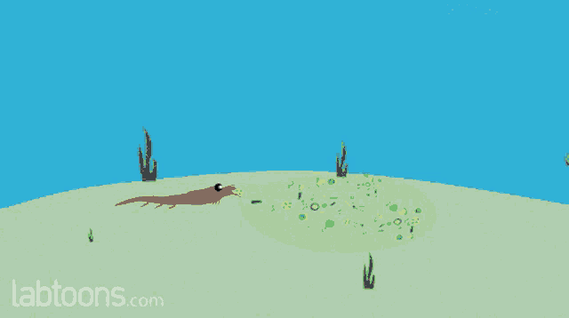

# Brown, Green, and Everything in Between: Seasonality drives green and brown energy pathways in food webs across an ecosystem gradient

## Abstract

Food web structure and function is spatially and temporally dynamic, yet few studies track their variance. Food webs typically include highly coupled fast, ‘green’ energy pathways driven by primary producers and slow, ‘brown’ energy channels driven by detritivores. Quantifying the amount of energy consumers derive from each of these pathways is important, particularly across multiple interconnected food webs over large spatial areas and over time. In this study, we used Bayesian mixing models to quantify the proportional contributions of brown and green energy pathways to functionally representative food webs across two coastal drainages that span freshwater marsh, riverine mangrove, and marine seagrass habitats over hydrologically distinct seasons. We found that green channels typically provided more total energy to consumers across both coastal drainages regardless of site and season. We observed a ‘greening effect’ as most sites exhibited greater reliance on green pathways during the wet season. Two sites were the exception and switched from green to primarily brown energy pathways between the dry and wet season. Although Everglades coastal food webs relied largely on green energy pathways, the proportional contributions of each energy channel and specific basal sources varied across both coastal gradients and seasons. Our results highlight the complexity of food web dynamics across ecosystem gradients and further investigation into mechanisms that drive shifts in energy pathway contributions will allow us to better anticipate how species, food webs, and ecological networks may respond to environmental drivers under future global change.

## Authors

- James W. Sturges
- W. Ryan James
- Ryan J. Rezek
- Rolando O. Santos
- Mack White
- Gina A. Badlowski
- Shakira Trabelsi
- Jordan Massie
- James Nelson
- Joel C. Trexler
- Jennifer S. Rehage

Corresponding Author: James W. Sturges; [jstur015@fiu.edu](mailto:jstur015@fiu.edu)

## Affiliations

1. Department of Earth and Environment, Institute of Environment, Florida International University, 11200 SW 8th Street Miami, FL 33199
2. Department of Biological Sciences, Institute of Environment, Florida International University, 11200 SW 8th Street Miami, FL 33199
3. Department of Marine Science, Coastal Carolina University, 100 Chanticleer Dr E, Conway, SC 29528
4. Department of Marine Sciences, University of Georgia, 325 Sanford Drive, Athens, GA 30602
5. Department of Biological Science, Florida State University, 319 Stadium Drive Tallahassee, FL 32306

## Contact

- Email: [jstur015@fiu.edu](mailto:jstur015@fiu.edu)

## Manuscript Highlights

- Green energy pathways support most aquatic food webs across an ecosystem gradient.
- Seasonality induces site- and source-specific changes to food web energy dynamics.
- Energy pathways are expected to be driven by nutrient dynamics and hydrology.

## Keywords

- Environmental gradient
- Ecosystem function
- Stable isotopes
- Resource use

## Acknowledgments

We thank our collaborators at Everglades National Park for their continued support of our research. Funding for this project was supported by the National Science Foundation through the Florida Coastal Everglades Long-Term Ecological Research (FCE-LTER) program under grant No. DEB-1832229. The authors declare no conflict of interest. This is contribution #X from the Coastline and Oceans Division in the Institute of Environment at Florida International University.

---

## Gif Section

Does anyone check these? Email me the gif so I know! I claim no rights to the gif file posted

